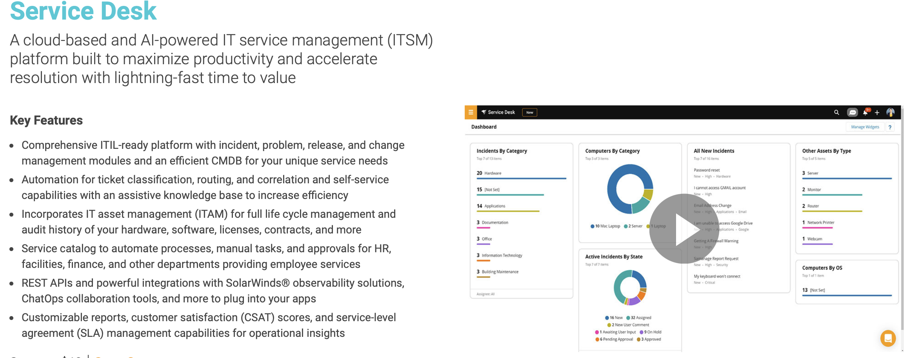
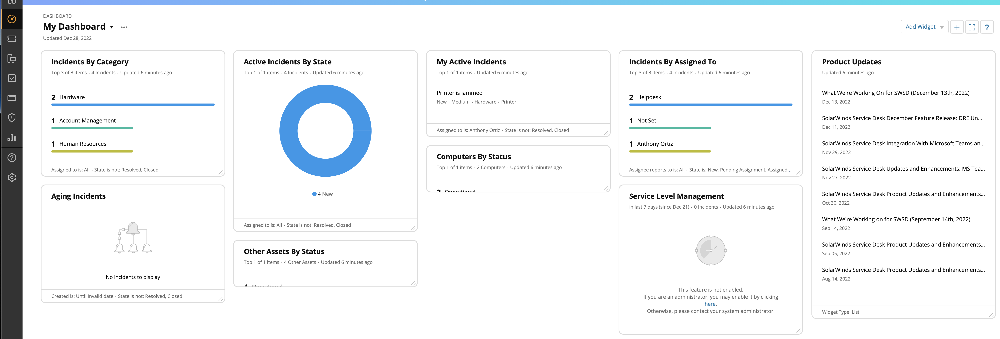

# Ticketing Systems - IT Help Desk and Beyond   

### Learning Objectives:
1. Ticketing systems - benefits, use cases and functionailties

### Technologies and Protocols:
* Solar Winds Service Desk

### What the heck is a ticketing system?
* A ticketing system allows IT support to track, manage, speed up, and deal effectively with incidents. The ticketing software can automatically distribute and assign incidents to the right IT staff member. 
* Service catalog standardizes service requests and fulfillment processes.
* Some ticketing systems even come with SIEM and automation funtionaility!

## Solar Winds Service Desk Overview: [FREE Trial](https://www.solarwinds.com/service-desk)

> We will be working with Solar Wind's tiecketing system but they all are **very similar**.

## Ticketing Dashboard

The dashboard - this is your central hub in ticketing systems. If you’re familiar with any SIEM or Meraki then this page should be no stranger to you. The dashboard gives you a quick glance at the status of your incidents, how long they have been on the shelf, information on assets and SLA MANAGEMENT. 

