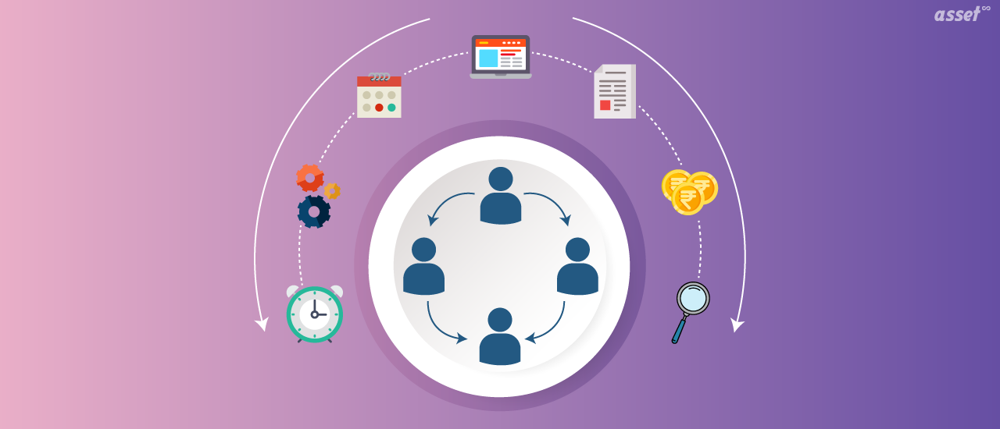
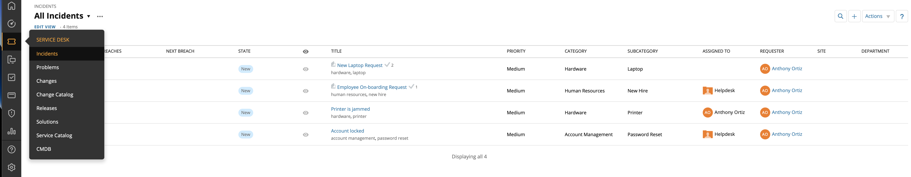
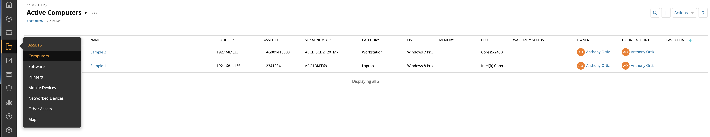
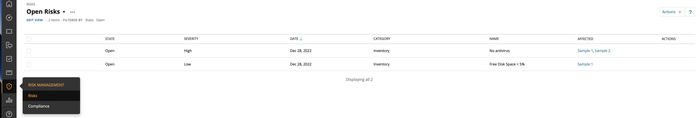
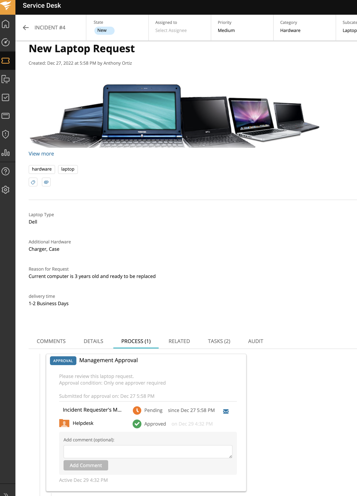
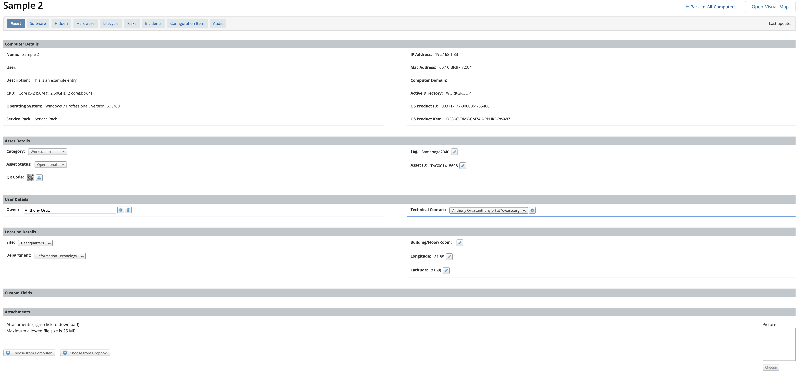
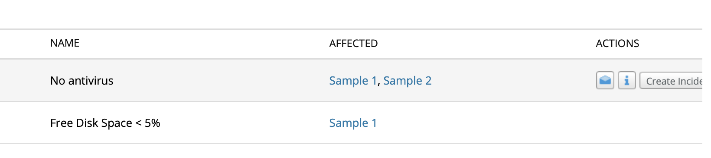

# Ticketing Systems - IT Help Desk and Beyond   

### Learning Objectives:
1. Ticketing systems - benefits, use cases and functionailties

### Technologies and Protocols:
* Solar Winds Service Desk

### What the heck is a ticketing system?
* A ticketing system allows IT support to track, manage, speed up, and deal effectively with incidents. The ticketing software can automatically distribute and assign incidents to the right IT staff member. 
* Service catalog standardizes service requests and fulfillment processes.
* Some ticketing systems even come with SIEM and automation funtionaility!

## Solar Winds Service Desk Overview: [FREE Trial](https://www.solarwinds.com/service-desk)

> We will be working with Solar Wind's tiecketing system but they all are **very similar**.

## Ticketing Dashboard

The dashboard - this is your central hub in ticketing systems. If you’re familiar with any SIEM or Meraki then this page should be no stranger to you. The dashboard gives you a quick glance at the status of your incidents, how long they have been on the shelf, information on assets and SLA MANAGEMENT. 

## Service Desk, Assets and Risk Management

Let’s take a look at the side panel on the home screen to explore some functionality you will come across in some ticketing systems today.

> Here we have SERVICE DESK: We can find incidents by category, priority and who has it been assigned to and by whom. We can also find problems, change control and solutions as well.

> Under ASSETS we find all our assets within in the company. Whether it’s hardware like computers and printers, or software like licensing fees you’ll find it all here.

> RISK MANAGEMENT gives you an overview at machines at risk - eg. *no antivirus* or *Free Disk Space <5%*

## Service Desk - New laptop request

Lets take a closer look at a new laptop request ticket:

Here we can see the details of the ticket request: the type of laptop, any additional hardware needed and the delivery time ETA. Further down we even see a Management Approval option.

## Assets - Sample 2

Under Assets > Sample 2 (computer example within Solar Winds) we see a detailed list of characteristics and hardware/software.

Additionally, we can see the domain the computer is a member of, the product key, any tags associated with the machine and so much more.

## Risk Management - Affected

If we go back to our Risk Management tab we see two items -  *no antivirus* or *Free Disk Space <5%*. Under *Affected*, we can see the machines that are affected by the corresponding risk. Here we send an email notification or create a new incident.

## Closing Thoughts

I encourage everyone to download this Solar Winds ticketing system and spend just 15 minutes clicking buttons and looking around. Whether you’re breaking into the industry or a seasoned vet, everyone can benefit from ticketing system exposure. 

Three skills you’ll practice:
1. DOCUMENTATION - detailed notes for your future self and fellow team mates.
2. RESOURCEFULNESS - practice using the resource at hand - notes, previously solved tickets and co-workers to name a few.
3. Looking like a boss talking ticketing systems during the interview.

